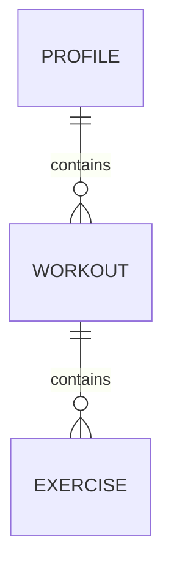

# Racetrak
A customizable workout planning algorithm focused on race preparation

> [!IMPORTANT]
> Racetrak is in active development towards our first stable release (v1.0.0). Things may break unexpectedly.

## Purpose

Racetrak was designed to bring the experience of great competition training plans and "AI" strength training apps together.

Racetrak is built on the following principles:

- Only an algorithm, does not attempt to store user data in any form (can dynamically ingest user input)
- Defining a training plan is easy, robust, and optionally granular
- Minimal dependencies, lightweight, and ultrafast (it is an algorithm after all)
- Support for multiple profiles that can be added by the community

## Schema

<!-- https://mermaid.js.org/syntax/entityRelationshipDiagram.html -->

